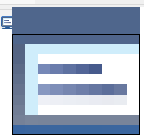

# Screen-Colour-Picker-GUI

This program selects a color from the screen. The color box can be moved using the movement arrows (up, down, left, right).
The color is saved in a txt file so that another program can read it and get the selected color